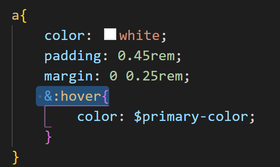
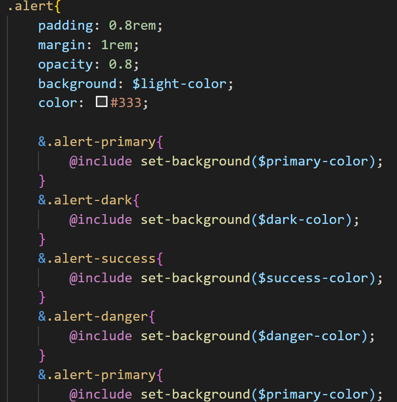
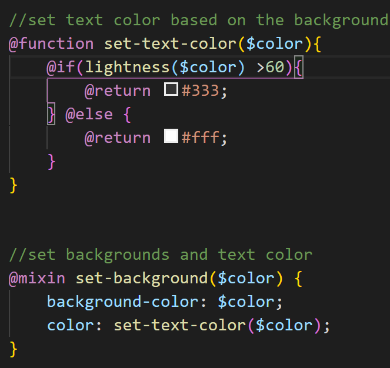
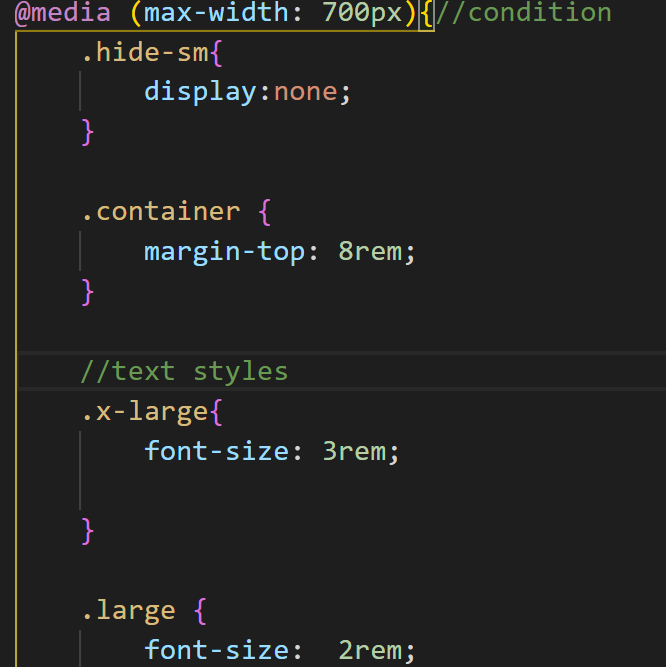
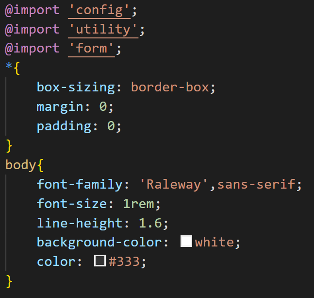
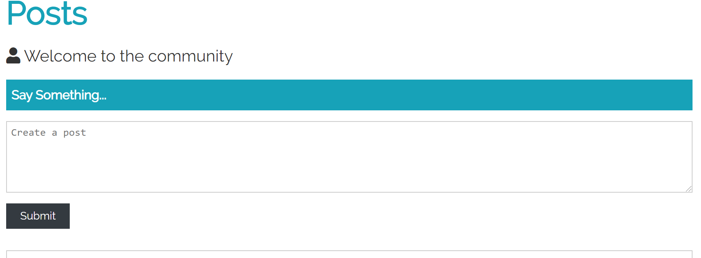
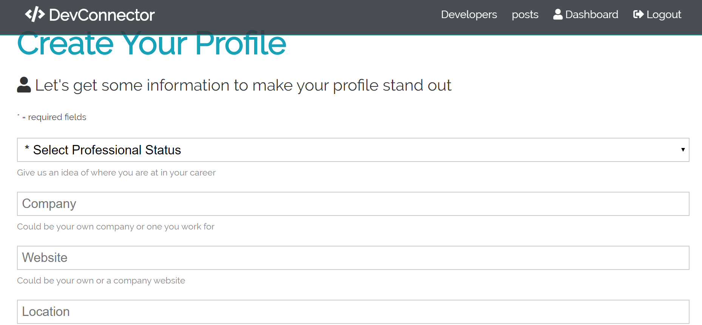
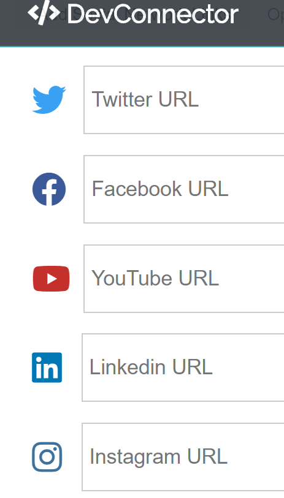

# Saas
A project for exploring saas css

Creating a theme for a couple web pages using SAAS CSS 

<h1>A. Summary of learning</h1>

<h2> 1. setting up hovering or other events using ampersand (& ):</h2>
<h3> 1.1. Setup events</h3>

inside the class, &:hover makes it easier to prepare hovering in CSS.

<h3> 1.2. Accessing subclass </h3>

inside the class, subclass can be defined with the ampesand. By this way, CSS becomes more logical with class/sub-class

<h2>2. Function in Saas Css </h2>
<h3>2.1. Passing a variable</h3>

 In SAAS, we can have functions. These functions are tools for setting up CSS based on a specific value. For example, in this function, a variabe is passed and the value of margin/space/padding are setted based on the name of the class passed.

<h3>2.2. If-else statement</h3>

Now, with SAAS, we can have if-else statement for CSS so that the front-end becomes more unexpected ! 

 A new feature is introduced here, called mixin. <strong>Mixin</strong> is a global function and is compiled instantly to CSS code whereas <strong>functions</strong> return a value (or values) that will <strong> be passed </strong> to a <strong>mixin</strong> 

<strong>Besides using if-else to return a value, if-else statement can also be used to setting up responsive front-end</strong>. Specifically, the condition of the IF is the size of the devices. In the example from this project, when the max-width is 700px (standard for smart phone), some items such as the NavBar or the lists will be compressed or hidden to give a clean interface.

 
 
 
 <h2>3. Importing from other SCSS files</h2>
 
Quite similar to react, the concept here is that we put everything inside a main SCSS file. Other css files are imported to this main file.

  
  
  <h1>B. Some pictures from the project</h1>
  <h3>1. A user profile</h3>
    
    <h3>2. A user's post</h3>
    
     <h3>3. Updating a new account</h3>
    
     <h3>4. Some <strong>very NICE</strong> social media icons with their colors programmed by SASS with sub-class naming</h3>
    
    
  
  
 
 
